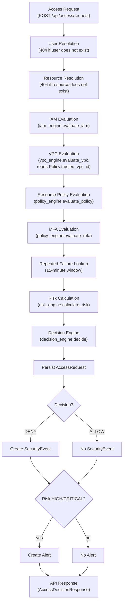

# Authorization Flow Diagram

Reflects the exact processing order implemented in
`backend/app/services/access_service.py::evaluate_access_request`.

## Notes

- All five evaluations (IAM, VPC, policy, MFA, risk) run unconditionally
  on every request, regardless of whether an earlier one already fails -
  this is what allows the API response to explain every check, not just
  the first one that failed.
- Only the decision engine combines these results into a final
  ALLOW/DENY; no earlier step short-circuits the response.
- A `SecurityEvent` is created for every DENY (never for an ALLOW). An
  `Alert` is created for any HIGH/CRITICAL-risk request regardless of
  the final decision.
