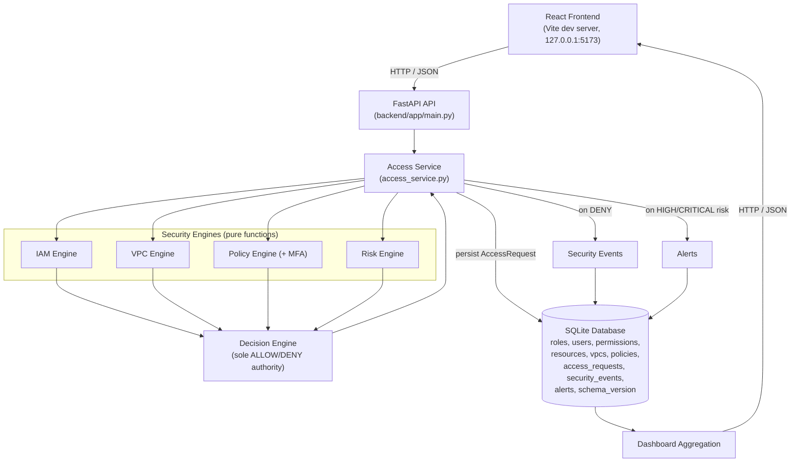

# System Architecture Diagram

Reflects the actual implemented components (`backend/app/main.py`,
`backend/app/services/access_service.py`, `backend/app/engine/*.py`,
`backend/app/db/models.py`, `frontend/src/`).

## Notes

- The frontend never computes a security decision; every value shown is
  read from an API response.
- Every engine is a pure function (plain inputs in, a structured result
  out) - none of them query the database directly. Only the access
  service (and, for policy edits, the policy service) touches the
  database.
- The decision engine is the only component that produces a final
  ALLOW/DENY value.
