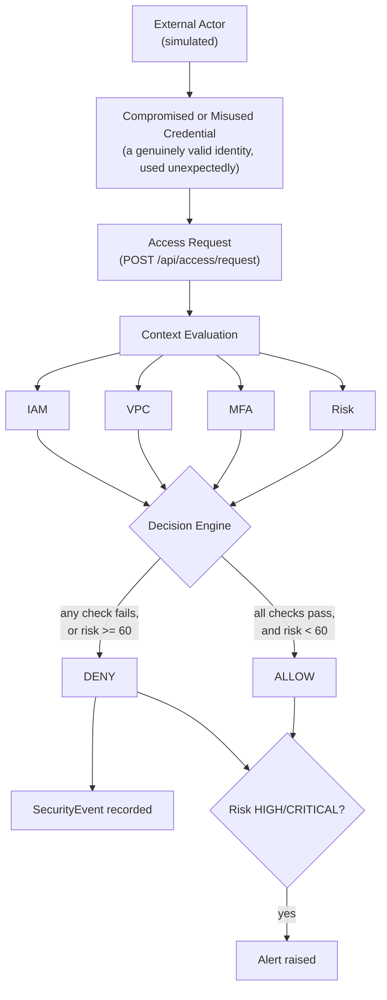

# Threat Model Diagram

A generalized view of every threat scenario in
[`THREAT_MODEL.md`](../../THREAT_MODEL.md); each is a real request
submitted to the running application, never a real-world attack.

## Interpretation

A valid identity (IAM PASS) reaching the decision engine is not, by
itself, evidence that access should be granted - VPC, MFA, and risk are
evaluated independently and any one of them can still produce DENY. This
diagram generalizes threats T1-T5 from the threat model (compromised
credential, wrong network, missing MFA, unauthorized resource,
privilege escalation); T6 (repeated requests) is reflected in the Risk
box via the repeated-failure factor, and T7 (sensitive storage exposure)
is a configuration-review concern rather than a per-request decision
path and is therefore not part of this per-request flow.
